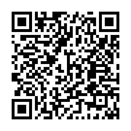

# 📱 UnDecimal — универсальный конвертер чисел и данных

**UnDecimal** — это мобильное приложение на React Native (Expo), позволяющее удобно и быстро конвертировать значения между системами счисления и единицами измерения цифровых данных. Приложение также ведёт историю операций и предоставляет информацию о себе во вкладке "О приложении".


## 📲 Установка

Сканируйте этот QR-код на своём телефоне, чтобы загрузить приложение:




---

## 🎯 Основные возможности

- 🔢 Конвертация чисел между системами счисления: **двоичная, восьмеричная, десятичная, шестнадцатеричная**
- 💾 Перевод единиц данных: **бит, байт, КБ, МБ, ГБ, ТБ**
- 🕘 Хранение истории всех операций с возможностью очистки
- ℹ️ Вкладка "О приложении" с описанием, версией и разработчиком
- 🌙 Темная тема по умолчанию (адаптивный интерфейс)
- 📱 Удобная навигация между вкладками
- ✅ Поддержка Android 5.0+ (API 21 и выше)
- 📦 Работает без нативных модулей — только чистый Phyton, с ипользованием Kivy

---

## 📂 Структура проекта

```bash
UnDecimalApp/
├── App.py                      # Главный файл приложения
├── screens/                    # Все экраны приложения
│   ├── HomeScreen.py           # Конвертация систем счисления
│   ├── DataUnitsScreen.py      # Конвертация единиц данных
│   ├── HistoryScreen.py        # История операций
│   └── AboutScreen.py          # Информация о приложении
├── assets/                     # Иконки, шрифты, splash-экраны
├── eas.json                    # Конфигурация сборки EAS
├── app.json                    # Конфигурация Expo
└── README.md                   # Этот файл
